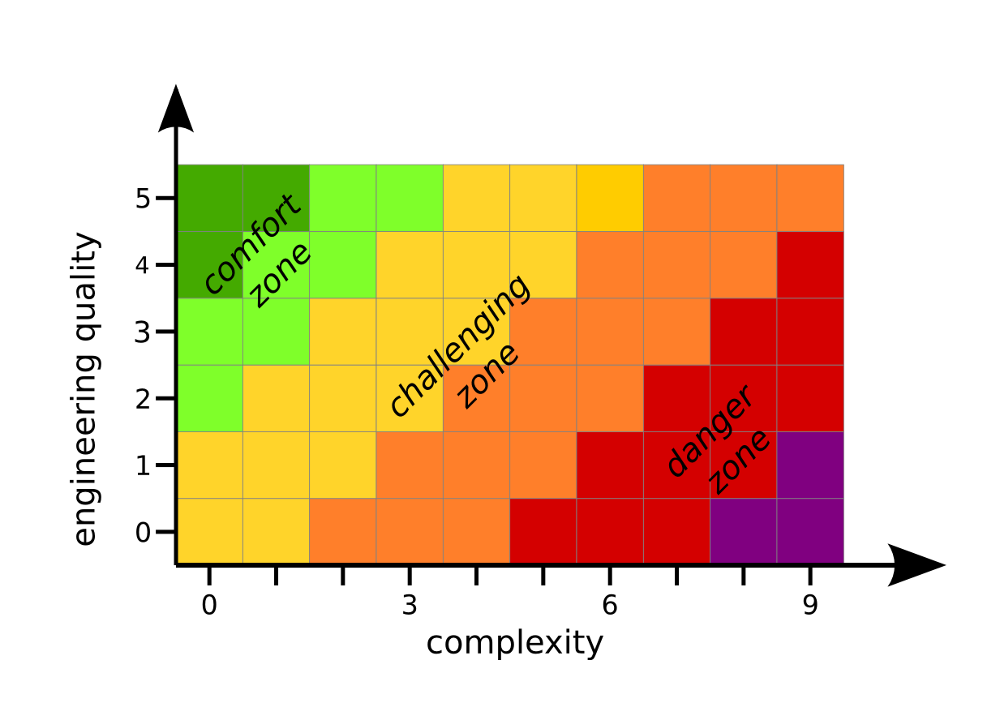

### Using the Legacy Metric
Your Legacy Metric should now consist of:

* A **complexity value** ranging from 0 (simple) to 9 (awfully complicated) .
* An **engineering quality value** ranging from 0 (messy) to 5 (well-kept).

You can use both values to locate your project in a coordinate system:

The graph can be roughly divided into a comfort zone (top left, green), a challenging zone (center diagonal, yellow-orange) and a danger zone (bottom right, red-purple). Which area you are comfortable to work in depends, of course, on your level of experience.

You can use the diagram in two ways:

1. **Locate yourself**: Check where your past projects would locate. If you come across a legacy project that is considerably more challenging than what you did before, this gives you a warning.
2. **Check other projects**: Look at a few programs you are using and check where they would locate in the graph. This gives exercise will give you a better feeling for code not written by yourself. The day you take over a project you will be prepared.

We would like to add a practical example:

### The Modomics project

As told in the beginning, the Modomics project was challenging back in 2007. Although I found none of the technical tasks particularly difficult, the number of unknown things accumulated. There was a good general structure, but in the details I frequently found myself tracing Python & HTML code line by line. As a result, adding even small features and debugging became a daunting task.

The Legacy Metric would locate the Modomics project in the orange zone:

* **complexity: 6 points** (2 for LOC, 3 for components, 1 platform)
* **Engineering: 2 points** (repository and modularization)

Back in 2007 after recovering from the initial shock, I approached the software by improving the present structure even more: I refactored out smaller functions with descriptive names. I placed logic into a separate, unit-tested Python package, so that the web framework became even slimmer. I drew a data model for the database. I wrote a separate tool filling the database.

Today, I would start with rigorous testing and adding tests for the web interface (which I didn't know in 2007). This should speed up improving the structure and help with debugging HTML.

#### Project summary

| Name | Modomics |
|------|----------|
| Summary | Web database of modified RNA nucleotides. |
| Duration | 2006 - 2014 |
| Developers | 2 coders (2009) |
| Stakeholders | 2 senior scientists, 4 data curators (2009) |
| Size | ~10000 Python LOC |
| Technologies used | TurboGears web server   PostGreSQL database   Biopython   PIL |
| Development tools used | bug tracker (TRAC)   automatic tests (partial)   SVN repository   User Stories   Entity-relationship diagram |
| Publications | Machnicka MA, Milanowska K, Osman Oglu O, Purta E, Kurkowska M, Olchowik A, Januszewski W, Kalinowski S, Dunin-Horkawicz S, Rother KM, Helm M, Bujnicki JM, Grosjean H. MODOMICS: a database of RNA modification pathways: 2012 update. Nucleic Acids Res 2013 Jan 1;41(D1): D262-D267  Czerwoniec A, Dunin-Horkawicz S, Purta E, Kaminska KH, Kasprzak J, Bujnicki JM, Grosjean H, Rother K. MODOMICS: a database of RNA modification pathways. 2008 update. Nucleic Acids Res 2009 Jan;37(Database issue):D118-21. [Epub 2008 Oct 14]  Dunin-Horkawicz S, Czerwoniec A, Gajda MJ, Feder M, Grosjean H, Bujnicki JM. MODOMICS: a database of RNA modification pathways. Nucleic Acids Res. 2006 Jan 1;34(Database issue):D145-9. |

